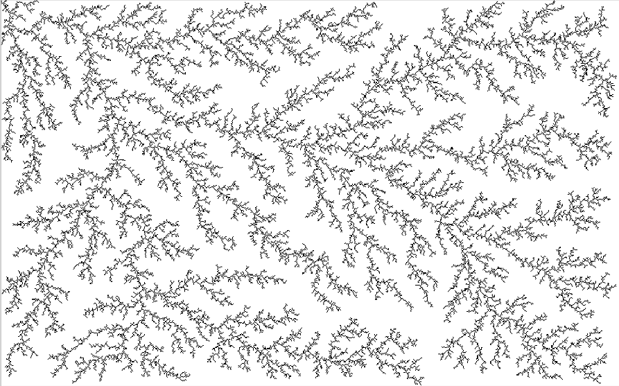

# Diffusion-Limited-Aggregation-simulation
Project for Embedded and Multicore Systems Programming

  
  
  

  
   
  <em>Example image from the execution of the project</em>

## Description
Diffusion-limited aggregation (DLA) is a process of crystal formation in which particles move in a 2D space with Brownian motion (i.e., randomly) and combine with each other when they touch. DLA can be simulated using a 2D grid where each cell can be occupied by one or more moving particles. A particle becomes part of a crystal (and stops) when it is in proximity to an already formed crystal. The basic parameters of the simulation are the size of the 2D grid, the initial number of particles, the number of iterations, and the initial "seed" crystal. Implement the DLA algorithm using 2 of the following approaches: MPI, PThread/OpenMP, CUDA.

Verify the correctness of the implemented algorithms, comparing the results with those obtained from a single-thread version. Evaluate the performance of the developed algorithms in terms of speed-up and efficiency as the number of processes/threads and the problem dimensions (number of particles, number of iterations, and grid size) vary.

## Usage

To run, first download the folder:

    $ git clone https://github.com/Dalphan/Diffusion-Limited-Aggregation-simulation.git
    $ cd Diffusion-Limited-Aggregation-simulation
    $ make all

The executables will be in the /bin directory.

The Makefile included in this project contains several pre-configured commands that serve as examples of how to use the application. These commands are designed to demonstrate various features and usage scenarios.

Requirements
------------
OpenMP and MPI

The images resulting from the simulation will be found in the /res folder